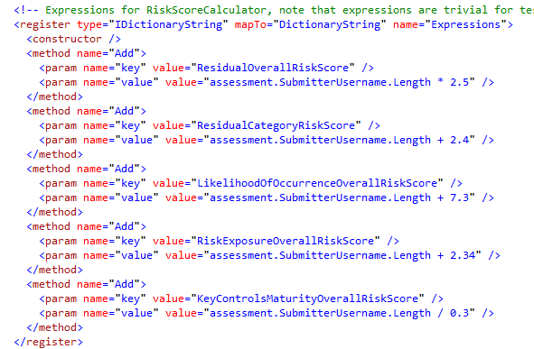

# JOHN HANCOCK - PROJECT COEUS
Deployment Guide

### The web application to manage the risks. 

## Prerequisites
1. Windows Server 2008+. (Required) 
	1. .NET Framework 4.5 is installed. (Required)
	1.  Active Directory(AD) is installed. (Required)
1. Visual Studio 2015 with Visual C# is installed. (Required)
1. MS SQL Server 2012. (Required)
1. Microsoft IIS 8.5 with .Net framework 4.5 is installed on the machine. (Required)
1. Chrome with Postman is installed. (Optional, required to verify REST API only) 

## Configuration
### 1. Active Directory (AD) Setup
1. Install and configure Active Directory. Please refer **Docs\ADSetup.docx** for guide on configuring AD.
1. Create a AD group name "CoeusUsers" or any suitable name
1. Create following users and assign them in above group.  
 - samAccountName=**CoeusOwnerUser1**, Full Name=CoeusOwnerUser1, First Name= CoeusOwner, Last Name=User1
 - samAccountName=**CoeusBUFuncApp1**, Full Name=CoeusBUFuncApp1, First Name= CoeusBUFunctionalApprover, Last Name=User 1
 - samAccountName=**CoeusRiskManager**, Full Name=CoeusRiskManager, First Name= CoeusRiskManager, Last Name=User1
 - samAccountName=**CoeusDivManager**, Full Name=CoeusDivManager, First Name= CoeusDivisionalManager, Last Name=User1
 - samAccountName=**CoeusAdminUser**, Full Name=CoeusAdminUser, First Name= Coeus, Last Name=Admin
 - samAccountName=**KSTNormalUser**, Full Name=KSTNormalUser, First Name= KST, Last Name=NormalUser

	>Note: All user must have password as “password” and user information should be same as above to pass the unit tests.

### 2. Database Setup
1. Create a new database named projectCoeus.
1. Create the database schema through script file: **Src\Server\database\DDL.sql**
>Note: To insert initial user mapping in database, please use **Docs\UserMappingScript.sql**.  

### 3. Application Setup
Both API(backend) and frontend needs to configured as:
### 3.1. Backend Configuration
Configure the **Src\Server\src\JohnHancock\web.config**, **Src\Server\src\JohnHancock.ProjectCoeus.Tests\App.config**, and **Src\Server\src\JohnHancock.KPIScorecard.Tests\App.config**. Make it fits your environment.

1. Update database connection string.
1. Log4net configuration.
1. Dependency Injection through unity.
    Update the dependency property of following services. Others dependency property which are not list below you don’t need to update.
	1. Security Service
		- **ADUsersDomain** :	The Active Directory user’s domain path.
		- **ADAdminUsername**:	The Active Directory admin user name.
		- **ADAdminPassword**:	The Active Directory admin user password.
		- **TokenExpiration**:	The token expiration time in minutes.
		
		Sample configuration is as below:

		
	1. User Service
		- **ADUsersGroupName** :	The Active Directory group name for coeus user. Group name created during AD configuration above.
		- **ADUsersDomain**: 	The Active Directory user’s domain path.
		- **ADGroupDomainTemplate**:	The Active Directory group domain template
		- **ADAdminUsername**:	The Active Directory admin user name.
		- **ADAdminPassword**:	The Active Directory admin user password.
		- **ADPropertyNameMapping**:	The mapping user property and Active Directory user attributes.
		
		Sample configuration is as below:

		

		Where ADPropertyNameMapping is configured as below, where key value represent the property name in User class where value of value param is attribute name of User object of Active directory.

		

	1. Risk Calculator
		- **Expressions** :	Expressions for RiskScoreCalculator.

		Sample configuration is as below:

		

		Where Expressions is configured as below

		

In **Src\Server\src\JohnHancock.ProjectCoeus.Tests\App.config** configure export folder, where unit tests will export the file:

Configure **Src\Server\src\JohnHancock.KPIScoreCard.Tests\App.config** and **Src\Server\src\JohnHancock\web.config** for KPI Scorecard tool related:
1. Update database connection string. (Src\Server\src\JohnHancock.KPIScoreCard.Tests\App.config only API is configured above)
1. Log4net configuration. (Src\Server\src\JohnHancock.KPIScoreCard.Tests\App.config only API is configured above)
1. Dependency Injection through unity. (Src\Server\src\JohnHancock\web.config only)
	- Configure **InputAllowedInDays** property in following controller AuditFindingController, BusinessUnitKPIScorecardController, OperationalIncidentController and PrivacyIncidentController. 
	See sample configuration for AuditFindingController below

	

### 3.2. Frontend Configuration
Please check file **Src\App\js\config.js**.

Usually you only need to change **REST\_SERVICE\_BASE\_URL**.

- **REST_SERVICE_BASE_URL**  :  the base URL of rest API
- **DATE_FORMAT**:	The date format to use  on the application
- **KPISLA_ASSESSMENT_CATEGORY_ID**:	The category id for KPI/SLA Assessment. The value should be taken from category table.
- **FUNCTIONAL_ASSESSMENT_CATEGORY_ID**:	The category id for Functional area process Assessment. The value should be taken from category table.
- **CORP_DIV_TRAINING_ASSESSMENT_CATEGORY_ID**:	The category id for Corporate & Divisional Training Assessment. The value should be taken from category table.
- **NO_CONTROLS_IN_PLACE_CONTROL_TYPE_ID**:	The id of No Control in place type of control types. The value should be taken from controlType table.
- **USER_DEFINED_KEY_CONTROLS_MATURITY_ID**:	The id of key controls maturity for which user comment is required. The value should be taken from [KeyControlsMaturity] table.
- **USER_DEFINED_KEY_LIKELIHOOD_OF_OCCURRENCE_ID**: The id of likelihood of occurrence for which user comment is required. . The value should be taken from [LikelihoodOfOccurrence] table.
- **USER_DEFINED_TESTING_FREQUENCY_ID**: The id of testing frequency for which user comment is required. The value should be taken from [TestingFrequency] table
- **MAXIMUM_ALLOWED_FUNCTION_CHANGES**: The maximum number of function changes allowed while edit/add assessment
- **DEFAULT_PAGE_SIZE**:	The page size for list pages.

>NOTE: Other properties in config file are moreover constants, used in views. So, you don’t need to configure them unless modifying code.

## Build Instructions
1. Extract the package.
2. Open **Src\Server\src\JohnHancock.ProjectCoeus.sln** with Visual Studio 2015.
3. Build the solution, ensure it is successful.

## Deployment
## 1. REST API (Backend) Deployment
1. Make sure you have configured the application. See **3.1. Backend Configuration** above.
1. Ensure build is successful, see **Build Instructions** above.
1. Deploy the Src\Server\src\JohnHancock directory to IIS with “ASP.NET v4.0 Integrated mode” application pool.

 	

>Note: The application user must have write permission on Src\Server\src\JohnHancock, otherwise log will not be created.
>Note: For testing purpose you can use Visual Studio 2015 to deploy the API. For that, in the Visual Studio 2015, right click the “JohnHancock project, click “Set as StartUp Project”. Click the “DEBUG->Start Without Debugging” menu. It will run the Web API project automatically. The URL is http://localhost:7104/ in my environment. The browser should open as

##2. Frontend App Deployment
Deploy the Src\App on IIS as:

1. Configure the application.(see 3.2. Frontend Configuration)
1. Open IIS manager and Add new site.

	

	>Note: The site must be at root level. Not under other sites.
1. Browser the application. You must see the login page.
>Note: If you don’t see the login page most probable issue is your folder doesn’t has the permission for IIS user. Set the permission on Src\App for the IIS User

## Production Build and Installation
Please see the Deployment section above to deploy.

## Running Tests
1. Configure the App.config in JohnHancock.ProjectCoeus.Tests see section **3.1. Backend Configuration**
1. Configure the App.config in JohnHancock.KPIScoreCard.Tests see section **3.1. Backend Configuration**
2. Build the JohnHancock.ProjectCoeus.Tests and JohnHancock.KPIScoreCard.Tests project:
Make sure **Src\Server\Src\JohnHancock.ProjectCoeus.Tests\bin\Debug\JohnHancock.ProjectCoeus.Tests.dll.config** and **Src\Server\Src\JohnHancock.KPIScoreCard.Tests\bin\Debug\JohnHancock.KPIScoreCard.Tests.dll.config** has the correct configuration.

1. Run unit tests:
	To run all automated tests, click menu **Test => Run => All Tests**.

	As a result you should see all tests are passed:

	

	>Note: If any tests failed then please re-run the failed unit tests, it may be because test data is changed or different in your environment.
1. To verify Export method, please verify the exported file in configured path in App.config of test project.    

## Verification
1. Insert the test data from **TestFiles\TestData.sql** into database  
1. To verify API using Postman application.
	### For Frontend related API	
	- Import the Postman collection **Docs\JohnHancock.ProjectCoeus.json.postman_collection** and environment **JohnHancock.ProjectCoeus.postman_environment** into the postman. 
	- Verify each endpoints
	>Note: The endpoints are not upto date, some are obselute.

	### For Admin related API
	- Import the Postman collection **Docs\JohnHancock.Project.Coeus.Admin.postman_collection** into Postman
	- Import the Postman environment **Docs\JohnHancock.ProjectCoeus.Admin.postman_environment** into Postman
	- Login with login endpoint (set the username and password per your enviormnet). The token will be automatically set by this call. You don't need to update the token.
	- Now, you can verify other endpoints.
	> Note: The template for import is **Docs\ImportLookup.xlsx**. While You can use **TestFiles\ImportLookup.xlsx** for testing.

	### For KPI Scorecard Tool API
	- Insert the test data from **Src\Server\database\KST_TestData.sql** into database  
	- Import the Postman collection **Docs\JohnHancock.KPIScorecard.postman\_collection.json** and environment **Docs\JohnHancock.KPIScorecard.postman_environment.json** into the postman.
	  
	- Verify each endpoint
	 
1. To verify all feature of application, please refer verification section of **Docs\verfication guides\Frontend Verification Guide.doc**
 > Note: To verify Admin Edit page feature, please refer **Docs\verification guides\Admin Edit Fields Part 1 Verification Guide.docx**
 > Note: To verify other admin Edit page feature including chart, please refer **Docs\verification guides\Admin Frontend assembly Part 2 Verification Guide.docx**
1. To verify user and role, please refer **Docs\verfication guides\Roles Update Verficiation Guide.docx**
1. To verify the changes done during admin release challenge, please refer **Docs\verification guides\Admin Release Assembly Verification Guide.docx**

 >To verify KPI Scorecard Tool please refer to **Docs\verfication guides\Verification Guide - KPI Scorecard.doc**  